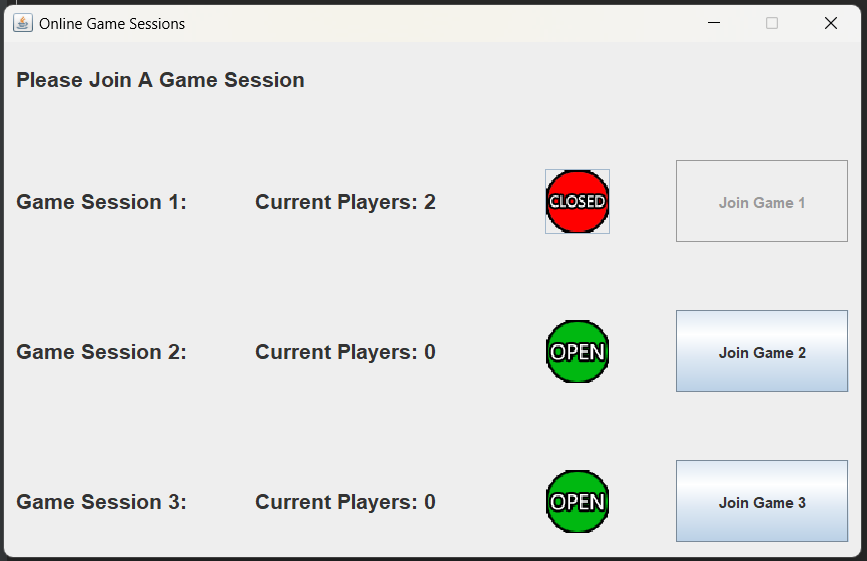
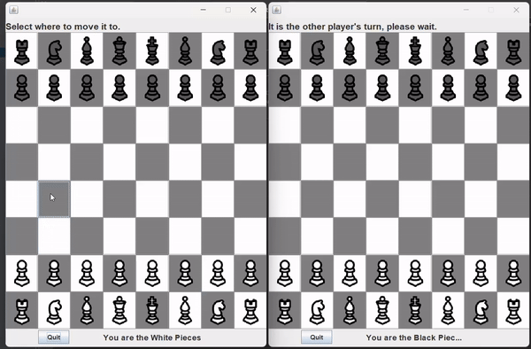

# ♟️ ChessRMI – Java RMI-based Chess Game

## 🛠️ How to Build & Run the ChessRMI Project

### 📦 About This Project

This is a **Maven-based Java RMI (Remote Method Invocation)** project. Maven handles everything from compiling and dependency management to packaging and running the application.

---

### 🔧 Installing Maven

If Maven isn’t installed yet, use:

```bash
sudo apt update
sudo apt install maven
```

Verify the installation:

```bash
mvn -v
```

# 🏗️ Building the Project
Once you're inside the project folder:

```bash
cd ChessRMI
mvn clean install
```
This command will:

🧹 Clean old compiled files

🛠️ Compile the source code

📦 Package the application inside the target/ folder

---

### ▶️ Running the Project

You’ll need **two terminals** open — one for the server and one for the client.

#### 1️⃣ Start the Server

```bash
mvn exec:java -Dexec.mainClass="Server.ChessServer"
```

This runs ChessServer.java located in src/main/java/Server/.

#### 2️⃣ Start the Client
```bash
mvn exec:java -Dexec.mainClass="Client.ChessClient"
```
This runs ChessClient.java located in src/main/java/Client/.


----

### Main Menu


----

### Game Board


----
# chessRMI

# Note
## ⚠️ Fixing ImageIcon NullPointerException
If you see an error like:

```csharp
java.lang.NullPointerException
    at javax.swing.ImageIcon.<init> ...
```
It's likely due to a missing image file. Here's how to fix it:

✅ Step-by-step fix:
Move all image files (e.g. open.png) to the following directory:

```css
src/main/resources
```
Update the image loading code to:

```java
ImageIcon openIcon = new ImageIcon(getClass().getResource("/open.png"));
```
The leading / tells Java to load the file from the root of the classpath (i.e., from resources/).
